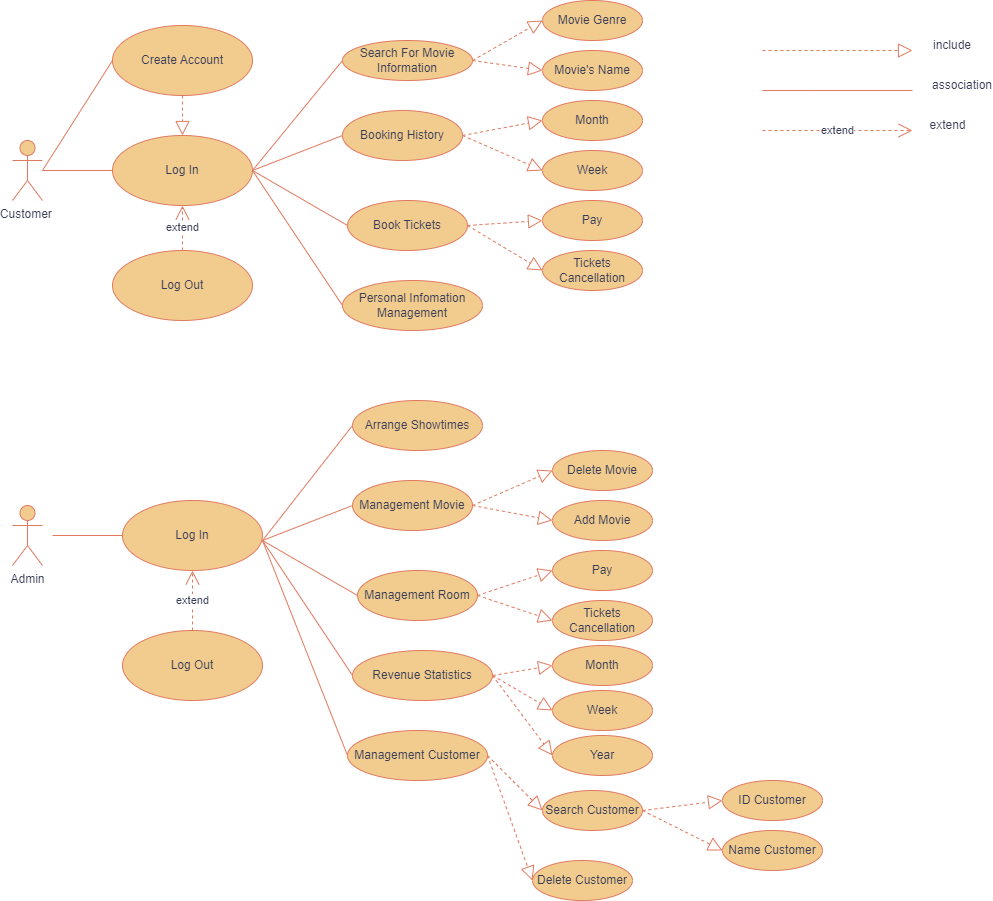
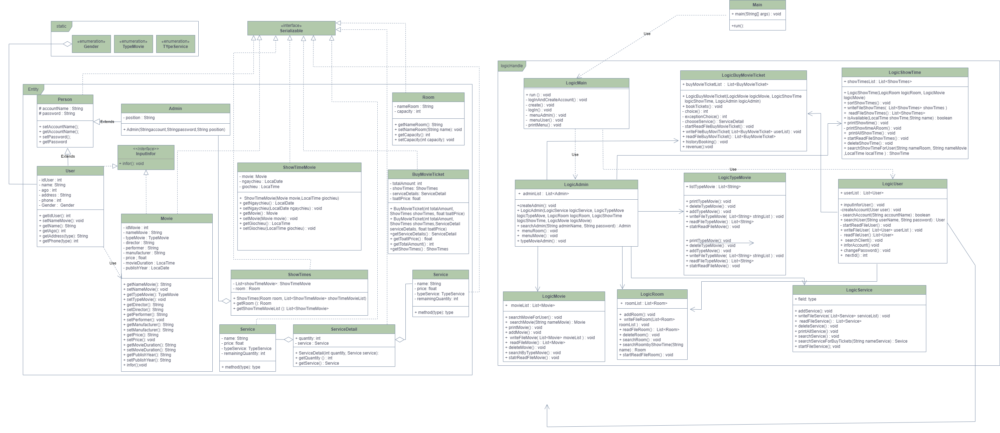

# PHẦN MỀM QUẢN LÝ RẠP CHIẾU PHIM VÀ BÁN VÉ
## 1. Giới thiệu 
 Phần mềm quản lý rạp chiếu phim và bán vé là một công cụ quan trọng giúp các rạp chiếu phim quản lý hoạt động kinh doanh hiệu quả hơn. Đây là một phần mềm đa năng được phát triển để giúp rạp 
 chiếu phim tổ chức và quản lý các khía cạnh khác nhau của hoạt động , bao gồm bán vé, quản lý suất chiếu, theo dõi doanh số bán hàng, quản lý thông tin về phim, và nhiều chức năng khác.

## 2. Các chức năng cơ bản của phần mềm 
- Đăng Nhập hệ thống: Phần mềm chó phép 2 quyền đăng nhập
   - Khách Hàng
   - Admin
## UML Use Case Diagram :

## Chức năng của Admin:
1. **Quản lý thông tin phim**:
     - Thêm, sửa, xóa thông tin về các bộ phim đang chiếu.
     - Xác định các chi tiết về phim, bao gồm tên, đạo diễn, diễn viên, thể loại, ngày công chiếu, và nội dung phim.
     - Đặt giá vé cho từng bộ phim.
2. **Quản lý lịch chiếu**:
     - Xây dựng lịch chiếu cho các bộ phim với các buổi chiếu cụ thể.
     - Kiểm soát số lượng vé còn lại và số lượng vé đã bán.
     - Theo dõi và quản lý sự kiện bắt đầu và kết thúc của các buổi chiếu.
3. **Quản lý vé bán**:
     - Theo dõi và quản lý việc bán vé cho các buổi chiếu.
     - Xem thông tin về các giao dịch bán vé và danh sách khách hàng đã mua vé.
     - Tạo vé điện tử hoặc phiếu vé.
4. **Quản lý khách hàng**:
     - Thêm, sửa, xóa thông tin của các khách hàng.
     - Theo dõi lịch sử mua vé của khách hàng.
     - Tạo vé điện tử hoặc phiếu vé.
5. **Thông kê daonh thu** :
     - Tạo các báo cáo thống kê về doanh số bán vé, doanh thu, lịch sử buổi chiếu, và hoạt động của rạp chiếu phim.
6. **Đăng xuất khỏi hệ thống**:
### Chức năng của Khách hàng:
1. **Xem lịch chiếu và phim**:
    - Khách hàng có thể xem lịch chiếu của các phim hiện đang chiếu và sắp tới.
    - Họ có thể tìm hiểu về các phim, bao gồm tựa đề, thời lượng, diễn viên, và thể loại.
2. **Mua vé**:
    - Khách hàng có thể chọn phim và suất chiếu mà họ muốn xem.
    - Họ có thể chọn ghế ngồi và số lượng vé cần mua.
      - Mỗi khi chọn ghế sẽ hiển thị phần ghế đã được các khác hàng trước đặt vé và hiển thị các ghế còn trống cho khách hàng lựa chọn.
      - Mỗi vé được đặt thì hiển thị của ghế đó đã được đặt với những khách hàng tiếp theo.
      - Hiển thị phần số lượng vé còn lại cho suất chiếu mà khách hàng đã chọn.
3. **Thanh toán**:
    - Phần mềm hỗ trợ thanh toán vé trực tuyến qua các phương thức thanh toán an toàn như thẻ tín dụng hoặc ví điện tử.
    - Họ cũng có tùy chọn thanh toán tại quầy rạp.
4. **Quản lý thông tin cá nhân**:
    - Khách hàng có thể cập nhật thông tin cá nhân của họ như tên, địa chỉ, số điện thoại và email.
    - Họ có quyền xem lịch sử mua vé và thông tin tài khoản của họ.
5. **Đăng xuất khỏi hệ thống**:

## Biểu Đồ Class Diagram

## 3. Kết quả sau khi làm đồ án
 * Làm ra phần mềm quản lý chiếu phim và bán vé
 * Hiểu và biết thêm về kiến thức Java-Core
## 4. Hướng Phát triển trong tương lai
 * Kết nối với mạng xã hội và cho phép khách hàng chia sẻ trải nghiệm của họ với bạn bè.
 * Cải thiện bảo mật: Đảm bảo rằng dữ liệu khách hàng và thanh toán được bảo mật tối đa để tránh rủi ro về bảo mật thông tin cá nhân.
 * Cải thiện quản lý lịch chiếu để tối ưu hóa hiệu suất của rạp chiếu phim, bao gồm lên lịch tự động và theo dõi hiệu suất chiếu.
 * Tối ưu hóa giao diện người dùng để đảm bảo trải nghiệm người dùng tốt hơn. 
